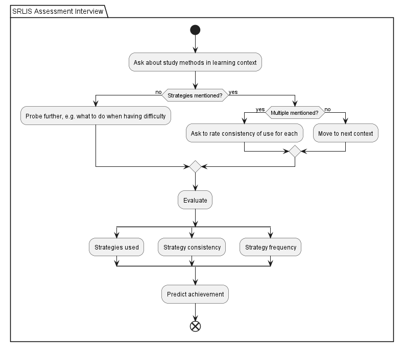

## Overview

This app provides an API backend to hold a conversation with an AI agent capable of assessing 
self-regulated learning skills based on Zimmerman and Martinez-Pons' Self-Regulated Learning Interview Schedule.

Zimmerman, B. J., & Martinez-Pons, M. M. (1986). _Development of a Structured Interview for Assessing Student Use of Self-Regulated Learning Strategies._ American Educational Research Journal, 23(4), 614–628. https://doi.org/10.2307/1163093

## Local development

The API and Discord bot can be started using Docker Compose. For local development, the API container's port 5000 is exposed while for deployment, for security reasons, the API is not exposed to the internet but only accessible from other containers within the Compose network.
The Compose file starts the API server in development mode so that it automatically reloads when any changes are made to files in the `api` directory. Note that the Discord bot needs to be restarted manually after changes are made.

### Running the app locally

Prerequisites: A system with Docker installed.

- Clone the git repository
- Copy the env.example file, renaming the new file .env
- Set BASE_URL=http://132.176.10.80/v1 to use the university hosted Ollama server, or to the URL of any other OpenAPI compatible endpoint
- Set API_KEY=ollama or the required API key for the BASE_URL. If no API key is required this field must still be set to any dummy value
- Set PG_HOST=postgres-dev
- Set MODEL to one that is available under the BASE_URL instance (for example meta-llama/llama-3.1-8b-instruct or mistralai/mixtral-8x22b-instruct)
- The other settings can stay as they are. There should be no need to set BOT_TOKEN, API_URL or DISCORD_SERVER_ID as these are required for the Discord bot which is not required for local testing
- Run the following command:
```shell
docker compose -f develop.docker-compose.yml up postgres-dev api-dev
```

The following endpoints will then be available:

```http request
POST http://127.0.0.1:5000/startConversation
Content-Type: application/json

{
    "language": "de", // "de" or "en" currently supported
    "client": "discord",
    "userid": "123" // needs to be unique for the client, can be set to any string value when testing locally
}
```

```http request
POST http://127.0.0.1:5000/reply
Content-Type: application/json

{
    "message": "A user response",
    "client": "discord",
    "userid": "123" // client and user values need to match the values sent in startConversation request
}
```
## DB backup
```shell
sudo docker container exec -it studybotpy-postgres-1 bash
mkdir /backup
pg_dump srl_chat /backup/pg_backup_<date>.sql
exit
mkdir /backup
sudo docker container cp studybotpy-postgres-1:/backup/pg_backup_<date>.txt /backup/pg_backup_<date>.sql
exit
scp user@VM:/backup/pg_backup_<date>.sql .
```

## App Structure
### _Needs updating!_


## Dialogue Flow
### _Needs updating!_



## Current status

The following steps need to be completed before the app is ready for user testing:

| Done? | Task                                                                                                                                                                                     |
|-------|------------------------------------------------------------------------------------------------------------------------------------------------------------------------------------------|
| ✓     | Define database models required for the app to function: users, conversation state and supported languages                                                                               |                                                                                                           |
| ✓     | Define database models for required interview elements: learning contexts, learning strategies and user answers connecting them                                                          |
| ✓     | Create API endpoint to send first response and perform initial setup for users in database                                                                                               |
| ✓     | Create API endpoint to reply to user message based on previous messages                                                                                                                  |
| ✓     | Populate learning contexts and strategies in database                                                                                                                                    |                                                    |
| ✓     | Implement dialogue loop with chained LLM prompts to ask about strategies for each learning context in turn, evaluate answers' mention of strategies and ask required follow-up questions |
| ✓     | Implement evaluation of learner SRL strategy use based on interview responses                                                                                                            |
| ✓     | Store results in database                                                                                                                                                                |
|       | Make answers and drawn conclusions viewable by users (including authentication; may be done after user testing has started)                                                              |