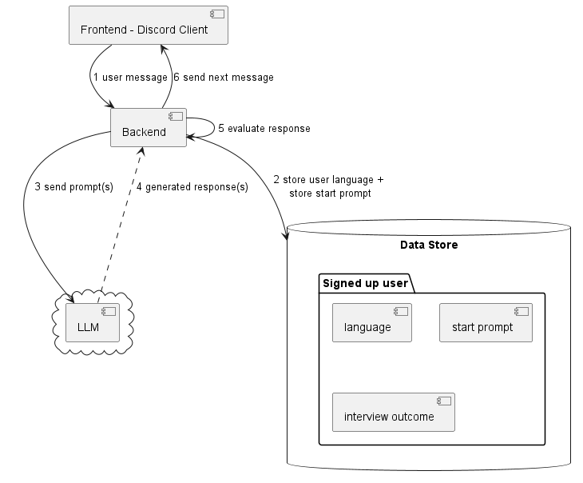

## Overview

This app provides an API backend to hold a conversation with an AI agent capable of assessing 
self-regulated learning skills based on Zimmerman and Martinez-Pons' Self-Regulated Learning Interview Schedule.

Zimmerman, B. J., & Martinez-Pons, M. M. (1986). _Development of a Structured Interview for Assessing Student Use of Self-Regulated Learning Strategies._ American Educational Research Journal, 23(4), 614–628. https://doi.org/10.2307/1163093

## Local development

The API and Discord bot can be started using Docker Compose. For local development, the API container's port 5000 is exposed while in the Kubernetes deployment, for security reasons, the API is not exposed to the internet but only accessible from within the cluster.
The Compose file starts the API server in development mode so that it automatically reloads when any changes are made to files in the `flask_v2` directory. Note that the Discord bot needs to be restarted manually after changes are made.

Prerequisites: A system with Docker installed.

```shell
docker-compose up --build
```
```shell
# To restart Discord bot
docker-compose restart bot
```

## Kubernetes deployment (local)

Prerequisites: A system with Docker and Kubernetes (e.g. minikube) installed

### Building app images
```shell
cd .\kubernetes
& minikube -p minikube docker-env --shell powershell | Invoke-Expression
docker build -t studybotpy-api:v1.0 ..
docker build -t studybotpy-bot:v1.0 ..\discord
```

### Deploying app images
```shell
kubectl apply -f .\namespace.yaml
kubectl -n study-bot apply -f .
```

### Verifying deployment
```shell
kubectl -n study-bot get pods
kubectl -n study-bot get services
```

### Teardown
```shell
kubectl -n study-bot delete service api
kubectl -n study-bot delete --all deployments
kubectl -n study-bot delete --all pods
```

## Running the app locally

```shell
cd .\flask_v2\
flask run # use --reload option to interactively restart the app following code changes
```

The following endpoints will then be available:

```http request
POST http://127.0.0.1:5000/startConversation
Content-Type: application/json

{
    "language": "de", // "de" or "en" currently supported
    "client": "discord",
    "userid": "123" // needs to be unique for the client
}
```

```http request
POST http://127.0.0.1:5000/reply
Content-Type: application/json

{
    "message": "A user response",
    "client": "discord",
    "userid": "56"
}
```

## Making changes to the DB

```shell
cd .\flask_v2\
flask db migrate -m "Describe migration"
flask db upgrade
```

### To reinitialise DB from scratch

- Delete *.db file

```shell
cd flask_v2
flask db upgrade
python

Python 3.12.3 (tags/v3.12.3:f6650f9, Apr  9 2024, 14:05:25) [MSC v.1938 64 bit (AMD64)] on win32
Type "help", "copyright", "credits" or "license" for more information.
>>> from setup.db_setup import populate_contexts
>>> populate_contexts()

```

## App Structure



## Dialogue Flow


## Current status

The following steps need to be completed before the app is ready for user testing:

| Done? | Task                                                                                                                                                                                     |
|-------|------------------------------------------------------------------------------------------------------------------------------------------------------------------------------------------|
| ✓     | Define database models required for the app to function: users, conversation state and supported languages                                                                               |                                                                                                           |
| ✓     | Define database models for required interview elements: learning contexts, learning strategies and user answers connecting them                                                          |
| ✓     | Create API endpoint to send first response and perform initial setup for users in database                                                                                               |
| ✓     | Create API endpoint to reply to user message based on previous messages                                                                                                                  |
| ✓     | Populate learning contexts and strategies in database                                                                                                                                    |                                                    |
|       | Implement dialogue loop with chained LLM prompts to ask about strategies for each learning context in turn, evaluate answers' mention of strategies and ask required follow-up questions |
|       | Implement prediction of learner achievement and SRL skill based on interview responses                                                                                                   |
|       | Store results in database                                                                                                                                                                |
|       | Make answers and drawn conclusions viewable by users (including authentication; may be done after user testing has started)                                                              |